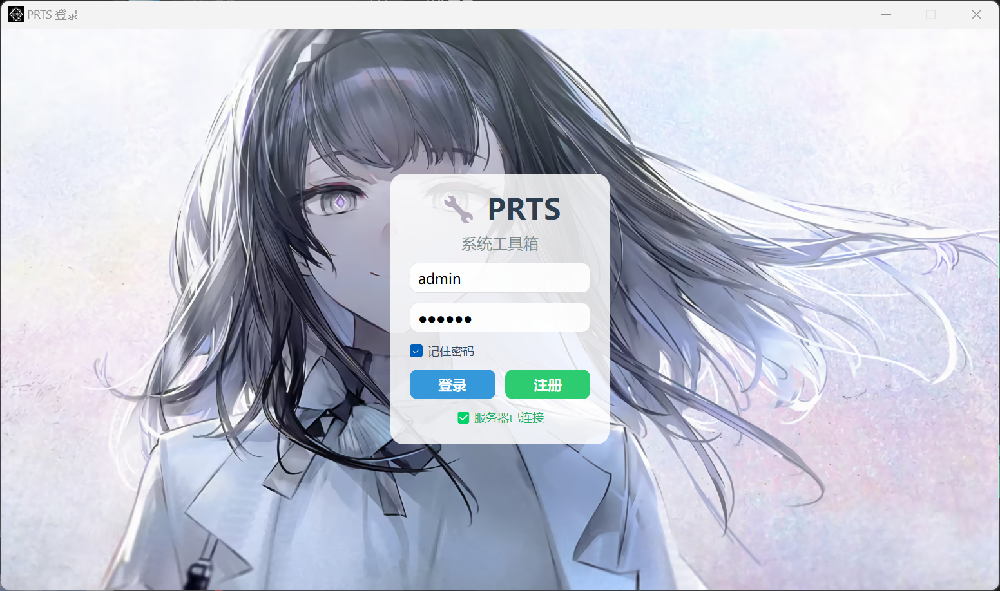
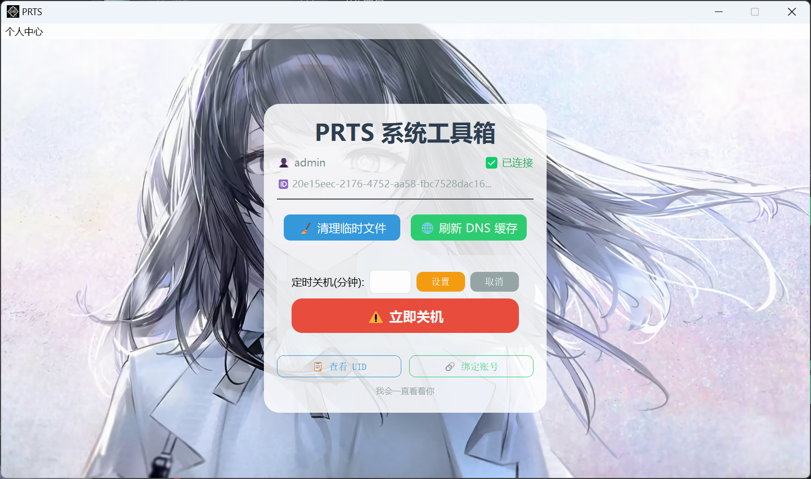

# 🔧 PRTS 系统工具箱

<p align="center">
  
</p>

<p align="center">
  
</p>

<p align="center">
  
  
  
  
</p>

<p align="center">
  <b>一款集本地系统维护、远程关机控制、账号管理于一体的现代化桌面工具箱</b>
</p>

---

## ✨ 主要功能

- **🖥️ 本地系统维护**  
  一键清理临时文件、刷新 DNS 缓存，保持系统清爽流畅。

- **⏻ 灵活关机控制**  
  支持立即关机、定时关机（分钟级），并提供 30 秒倒计时缓冲，防止误操作。

- **🌐 远程关机中继**  
  通过阿里云服务器 WebSocket 中继，手机/电脑浏览器访问网页即可远程关闭家中或办公室的电脑。

- **👤 用户体系**  
  注册 / 登录账号，绑定多台电脑 UID，精准控制不同设备。

- **🔐 记住密码**  
  登录凭据加密存储在用户目录，安全便捷。

- **🎨 现代化 UI**  
  基于 PyQt5 精心设计的毛玻璃风格界面，支持自定义背景图片和图标。

- **📦 单文件便携**  
  使用 PyInstaller 打包为单个 EXE，无需安装 Python 环境即可运行。

---

## 📸 界面预览

| 登录窗口 | 主界面 |
|:---:|:---:|
|  |  |

> *注：截图中的背景图 `prts.png` 可自行替换，程序会自动缩放至 30% 并居中显示。*

---

## 🚀 快速开始

### 环境要求
- Windows 10 / 11
- 无 Python 环境也可直接运行打包好的 `PRTS.exe`

### 直接使用（推荐）
1. 下载最新版 `PRTS.exe`（位于 `dist` 目录）。
2. 确保同级目录下有 `prts.png`（背景图）和 `prtscl.ico`（图标）——**已包含在发行包中**。
3. 双击运行，首次启动会自动生成配置文件 `.prts_config.ini`（保存在用户目录）。

### 从源码运行
```bash
git clone <your-repo-url>
cd PRTS
python -m venv .venv
.venv\Scripts\activate
pip install -r requirements.txt
python main.py
